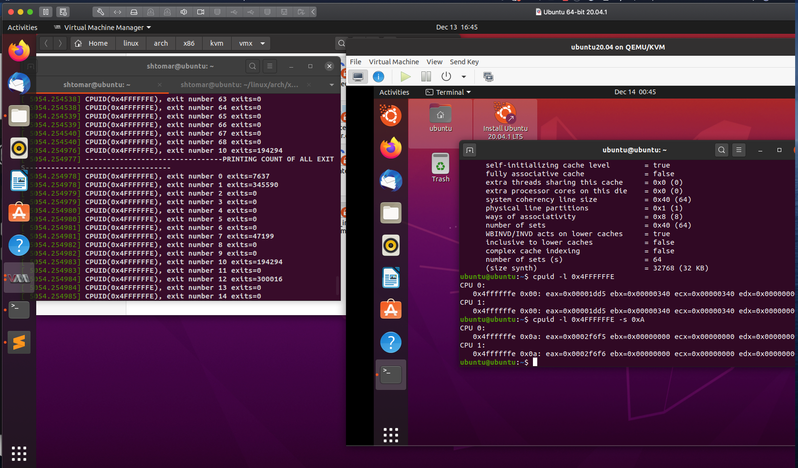
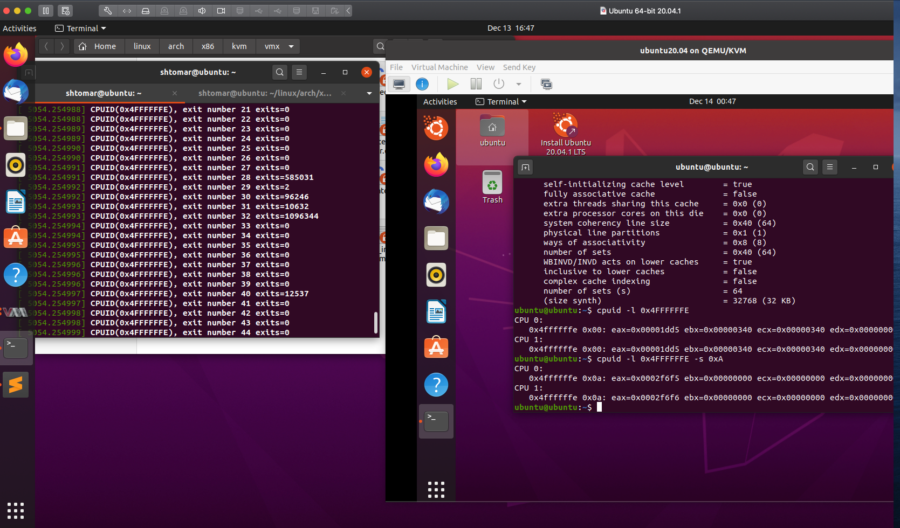
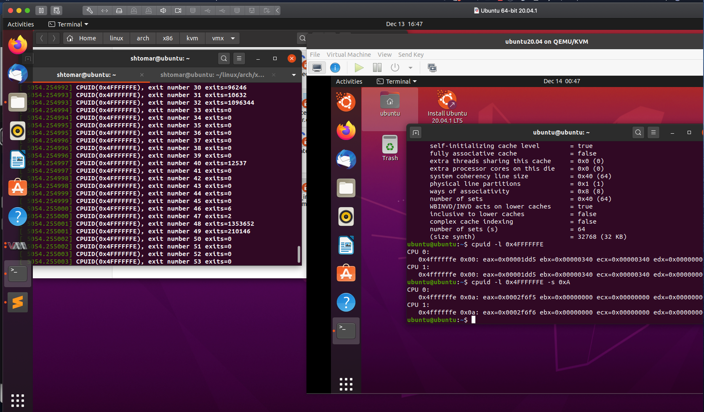

# CMPE283-Assignment4

NOTE – there is no coding required for this assignment. We are just running assignment 3 again in a different configuration.

Assignment-4
Run your assignment 3 code and boot a test VM using that code.
Once the VM has booted, record total exit count information (total count for each type of exit handled by KVM). You should do this via a sequence of queries of CPUID leaf function 0x4FFFFFFE.
Shutdown your test (inner) VM.
Remove the ‘kvm-intel’ module from your running kernel:
rmmod kvm-intel
Reload the kvm-intel module with the parameter ept=0 (this will disable nested paging and force KVM to use shadow paging instead)
The module you want is usually found in /lib/modules/XXX/kernel/arch/x86/kvm , where XXX is the version of the kernel you build for assignment 3 – don’t make a mistake and use the one that came with the stock Linux installation.
insmod /lib/modules/XXX/kernel/arch/x86/kvm/kvm-intel.ko ept=0
Boot the same test VM again, and capture the same output as you did in step 2.

======================================================================================

Q) Include a sample of your print of exit count output from dmesg

### The screenshots below shows the exit counts for all the exits supported by KVM.

======================================================================================

Q) What did you learn from the count of exits? Was the count what you expected? If not, why not? & What changed between the two runs (ept vs no-ept)?

We observed the following difference between ept and no-ept exit counts.

* The count of exits have increased a lot compared to Nested Paging. 

* Exits due to page faults, CR3 in, CR3 out and explicit TLB invalidations are the obvious ones that would increase. 

* We wouldn't expect any increase in exit causes unrelated to paging, such as interrupt exits. 

* Guest page table modifications need not be trapped, hence VM exits reduced. Reduced memory footprint compared to shadow page table algorithms.

======================================================================================

1) Shivam Tomar(SJSU ID: 015218203) 

   Removed Module , Reloaded with Ept=0 and ran Insmod . Tested Output

2) Srujana Koripalli(SJSU ID: 013859651)
  
   Removed Module , Reloaded with Ept=0 and ran Insmod . Verified Output

    
